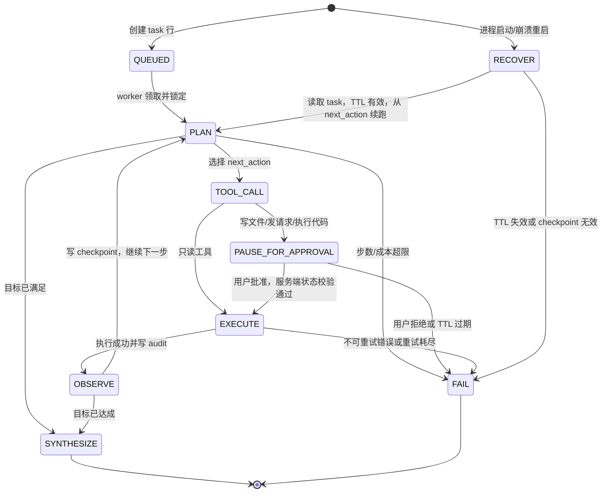

# Starry-Chat v0.2 → v0.8 演进路线图

> 实现状态（2026-10-03）：工作区已落地 v0.2（多用户/认证）、v0.3（规则路由+预算）、v0.4（工作记忆）并已接入聊天链路；v0.5（工具调用）与 v0.6（RAG）的模块、单测与聊天链路集成均已完成。v0.7（Agent）与 v0.8（多模态）尚未开始。版本号已归一到 __version__（v0.6.0）。

## 0. 基线与不变量

PR-1/2/3 已作为 v0.1.1 release-set 完成：它们是并发、上下文、安全、可观测性硬化，不算新的产品能力。当前代码仍有版本号漂移（`app/main.py`、`CHANGELOG.md`、README 的标签引用不一致），本路线图不在本轮修改运行时代码，只把 v0.1.1 作为规划基线。

当前系统的几个事实：

- 单机 SQLite WAL，默认 `WORKERS=1`；持久表是 `conversation` 和 `message`。
- `X-User-Id` 仍是未校验的 header 存根；真正的多用户隔离必须从 v0.2 开始补齐。
- 限流、会话锁、指标和成本缓存是进程内存态；不假设它们能跨 worker 或重启工作。
- LLM 通过 OpenAI-compatible SDK 调用，目前没有模型路由、工具调用、RAG、工作记忆或 Agent。
- 默认规模是单机、单 worker、内网小团队（少于 20 人）。未证明单机不够前，不引入分布式基础设施。

贯穿 v0.2-v0.8 的不变量：

1. **提示词只描述任务，不承担安全边界。** 权限、沙盒、资源上限和审计日志才是安全控制；提示词中的“不要执行危险操作”不能作为控制措施。
2. 新能力默认关闭：`AUTH_ENABLED`、`ROUTING_ENABLED`、`MEMORY_ENABLED`、`TOOLS_ENABLED`、`RAG_ENABLED`、`AGENT_ENABLED`、`VISION_ENABLED` 均应有明确的关闭路径。
3. 数据库变更向后兼容：优先 `CREATE TABLE IF NOT EXISTS` 和可空列；禁止用 `DROP` 破坏旧数据。需要重建表时，必须先备份并提供回滚脚本。
4. 第三方密钥只进环境变量或密钥管理器，不进 SQLite；用户密码只存慢哈希，不存明文。
5. 任何验收都必须能由命令、测试或 SQL 查询执行；“人工看起来没问题”不是验收标准。
6. 不允许通过增加 worker 掩盖进程内状态债。只有当单 worker 指标证明不够时，才启动多进程/多实例改造评估。

---

## 1. 不要做清单

| 版本 | 这个阶段不该引入什么 |
|---|---|
| v0.1.1 | 不新增产品能力；不做路由、工具、记忆、RAG、Agent 或多模态；不换框架、不引 ORM、不引迁移框架。 |
| v0.2 多用户与认证 | 不做 OAuth/SSO、第三方登录、RBAC、组织层级、邮箱找回、刷新 token、多租户计费或复杂权限表；不引新的认证依赖。 |
| v0.3 多模型路由 | 不用大模型做路由；不做语义分类器、A/B 平台、用户自定义 `base_url`、流式中途切模型或多 provider 抽象层。 |
| v0.4 工作记忆 | **不引入向量数据库、embedding、语义检索、跨会话长期记忆、记忆图谱或递归摘要。** 只做每 N 轮摘要。 |
| v0.5 工具调用 | 不用 `eval`/`exec` 实现 `calculate`；不提供写文件、发请求、执行代码工具；不做插件市场、MCP、用户自定义工具、并行编排或超过 3 个工具。 |
| v0.6 RAG | 不做 GraphRAG、爬虫、多路 rerank、托管向量库、embedding 微调、多模态文档解析或任意路径上传。先用 SQLite FTS5 建立基线。 |
| v0.7 Agent | 不用“生成器 + 长轮询”承载任务；不做无限深度拆解、多 Agent 协作、无人审批的写/发/执行动作，也不引入 Kafka、Redis、RabbitMQ。 |
| v0.8 多模态 | 不做视频、音频、图像生成/编辑、SVG 上传、本地重型视觉模型、图片向量检索或多图工作流。 |

---

## 2. 技术债偿还触发条件

| 技术债 | 当前状态 | 触发条件（可观测） | 偿还成本 | 偿还方案 |
|---|---|---|---|---|
| `X-User-Id` 未校验 | `app/deps.py` 直接信任 header，缺失时使用 `anonymous` | v0.2 启动；或出现 1 次越权报告 | 中 | 本地账号、scrypt 密码哈希、签名 Cookie；开关关闭时保留兼容路径 |
| 版本号漂移 | `main.py`、CHANGELOG、README 标签不一致 | 立即；每次发布前 CI 版本一致性检查失败 | 低 | 单一 `__version__` 来源，发布检查同时校验 healthz、CHANGELOG 和 tag |
| 文档与配置漂移 | 文档中的 retry、response token 等默认值与 `config.py` 不完全一致 | 任一配置项在文档与运行时不一致；或一次因错误默认值导致事故 | 低 | 从 `config.py` 生成配置参考，CI 对示例 `.env` 做解析测试 |
| 进程内限流/锁池 | `_hits`、`_conv_locks` 不跨 worker/重启 | `WORKERS>1`；或单实例 429 与业务日志差异 > 1%；或需要第二个实例 | 高 | 先维持单 worker；必要时使用 SQLite 共享窗口/任务表和 sticky routing，禁止先上 Redis |
| `/metrics` 无鉴权 | `/metrics` 当前只靠网络边界保护 | 服务端口暴露公网；或出现非预期抓取来源 | 低 | Nginx IP allowlist，或复用 `ADMIN_API_KEY`；不把敏感内容写入指标 label |
| 无迁移框架 | `db.py` 通过手写 `ALTER TABLE` 兼容旧表 | 累计 schema 分支 > 3，或出现 1 次生产 schema 事故 | 中 | 自研 `migrations/` + `schema_version` 表；保留 SQLite，暂不引 Alembic |
| `message.role` 不支持工具消息 | CHECK 只允许 `user/assistant/system` | v0.5 开工前 | 中 | 增加 `tool` 角色和可空 `tool_call_id`、`tool_calls_json`；迁移重建时保留旧行 |
| 没有工作记忆 | 只保留最近 40 条并做 token 裁剪 | “它总忘事”投诉 > 5 次/周；或截断计数周增 > 50 且会话消息中位数 > 40 | 中 | `conversation_memory` 表，每 N 轮异步生成摘要，失败时透明降级 |
| 没有成本预算护栏 | `/api/admin/cost` 只读统计，不阻止超预算 | 月成本 > 预算 20%；或单用户日 token P99 > 预算 2 倍 | 中 | v0.3 路由前增加按用户/日的 token 上限和拒绝响应 |
| 登录限流缺失 | 当前限流按 header 用户标识和 IP | v0.2 登录失败次数 > 30 次/分钟；或出现爆破告警 | 低 | 登录独立桶、恒定错误响应、成功后刷新会话 |
| 没有审计日志 | 没有可查询的动作轨迹 | v0.7 开工；或出现无法回答“谁在何时执行了什么” | 中 | `audit(task_id, action, args_hash, result, created_at)`，写/发/执行前后都落盘 |
| 手写 metrics 规模有限 | 当前约 11 个指标，内存态 | 指标 > 25；或需要 exemplars、持久 histogram、跨实例聚合 | 中 | 评估 Prometheus client；只有测得收益后才引入依赖 |
| 前端不能处理图片 | 当前只有文本 markdown 流 | 图片请求占比 > 5%；或“看图”请求 ≥ 5 次/周 | 中 | v0.8 增加白名单图片 part、重编码、大小/像素限制和清理任务 |

---

## 3. 版本路线（每版回答 5 个问题）

### v0.2 多用户与认证

1. **触发条件**
   - `conversation` 中非 `anonymous` 的 distinct `user_id` 连续 3 天大于 1；或
   - 越权/“看到了别人的会话”投诉 ≥ 1 次；或
   - 管理员需要按真实用户分摊成本，而当前 `by_user` 仍全部是 `anonymous`。

2. **最小可行实现（MVI）**
   - 新增 `user(id, username UNIQUE, password_hash, created_at)` 表。
   - 用 Python 标准库 `hashlib.scrypt` 存密码哈希，使用随机 salt；用 `hmac`/`secrets` 生成签名会话 Cookie，不建 session 表。
   - 新增注册、登录、登出三个 HTTP 动作；`get_current_user_id` 优先从已验证 Cookie 取用户。
   - `AUTH_ENABLED=false` 时暂时保留 `X-User-Id` 兼容路径，但生产配置默认开启认证。
   - `HttpOnly; SameSite=Strict; Secure`（生产）Cookie，登录接口使用独立限流桶；不引入 OAuth/SSO。

3. **引入的攻击面**
   - **新依赖**：无 Python 新依赖，但必须依赖操作系统的 scrypt 实现。
   - **新权限**：应用可以创建用户并读写认证 Cookie；`SESSION_SECRET` 成为新的生产密钥。
   - **新成本**：scrypt 是故意昂贵的 CPU 操作；登录、注册需要数据库写入。
   - **新故障模式**：登录爆破、账号枚举、Cookie 伪造、CSRF、密钥轮换导致全员登出、坏迁移导致旧会话无法读取。
   - **控制措施**：服务端登录限流、统一失败响应、强制非空高熵 `SESSION_SECRET`、会话签名校验；不把“请勿伪造 Cookie”写进提示词。

4. **如何回滚**
   - `AUTH_ENABLED=false` 立即切回 header 兼容路径。
   - `user` 表和新增字段保留，不影响旧的 `conversation`/`message` 行；不做破坏性迁移。
   - 若签名密钥泄露，轮换 `SESSION_SECRET` 并让所有旧 Cookie 失效，再重新登录。

5. **验收标准（可执行命令）**
   ```bash
   cd simple-chat
   pytest -q tests/test_auth.py tests/test_security.py
   # 实现后：注册 -> 登录 -> Cookie 发消息 -> 读取自己的会话
   bash scripts/e2e_auth.sh
   # 实现后：A 的 Cookie 访问 B 的会话必须返回 404
   AUTH_ENABLED=false pytest -q
   ```
   `tests/test_auth.py` 必须覆盖密码不落明文、伪造 Cookie 返回 401、A/B 会话隔离、登出后 Cookie 失效和登录限流。

### v0.3 多模型路由

1. **触发条件**
   - 按 `model_price × chat_tokens_total` 计算的月成本超过预算 20%；或
   - 估算 prompt token P50 < 500 且响应时长 P50 < 1.5 秒的简单问题占调用量 > 60%；或
   - `MODEL_UNAVAILABLE` 每周 ≥ 5 次，需要静态 fallback。

2. **最小可行实现（MVI）**
   - 只做**确定性规则路由**，不调用模型判断模型。
   - 优先级为：请求显式白名单模型 > `ROUTING_RULES`（JSON 配置中的长度/关键词规则）> 默认 `LLM_MODEL`。
   - 增加有序 `FALLBACK_MODELS`，只在首 token 前的连接/服务端错误时降级一次；已经输出 token 的流不切换。
   - 将实际模型写入消息元数据和 metrics；路由前执行每用户每日 token 上限。
   - 禁止用户传入 `base_url`；所有 endpoint 仍来自服务端环境配置。

3. **引入的攻击面**
   - **新依赖**：无；复用现有 OpenAI-compatible client。
   - **新权限**：应用获得调用多个 provider/model 的权限，配置错误可能暴露更高价模型。
   - **新成本**：fallback 可能造成重复请求；多个模型有不同单价和上下文限制。
   - **新故障模式**：规则误判、provider 错误码不一致、fallback 循环、首次失败已产生计费。
   - **控制措施**：模型 ID 白名单、每日 token 上限、最多一次 fallback、统一 `map_openai_error`、禁止运行时用户提供 endpoint。

4. **如何回滚**
   - `ROUTING_ENABLED=false` 时所有请求使用 `LLM_MODEL`。
   - 清空 `ROUTING_RULES` 和 `FALLBACK_MODELS` 后仍走默认模型。
   - 新增 `message.model` 等字段必须可空；关闭路由不需要数据回滚。

5. **验收标准（可执行命令）**
   ```bash
   cd simple-chat
   pytest -q tests/test_routing.py tests/test_budget.py
   ROUTING_ENABLED=false pytest -q
   BEHAVIOR=server_error python scripts/fake_upstream.py &
   python scripts/test_fallback.py
   ```
   测试必须证明：同一输入按规则选中预期模型；高价模型不会绕过预算；fallback 最多一次；已有 token 时不重试；关闭开关与基线输出一致。

### v0.4 工作记忆

1. **触发条件**
   - 用户投诉“它总忘事” > 5 次/周；或
   - `context_truncated_total` 周增 > 50，且会话消息数中位数 > 40。

2. **最小可行实现（MVI）**
   - **禁止向量数据库。** 每 N 轮生成一次摘要，固定 `N=20`（10 个来回）。
   - 新增 `conversation_memory(conversation_id PRIMARY KEY, summary, upto_message_id, updated_at)`。
   - 只摘要已经滑出原文窗口的历史；`build_context` 组合为系统消息、摘要（若有）、最近原文和当前用户消息，当前用户消息仍永远最后。
   - 摘要任务异步执行，失败不阻塞聊天，也不注入旧摘要；摘要使用低价模型或 v0.3 规则指定的模型。
   - 摘要是数据，不是权限来源；固定位置和长度由服务端控制，质量指令不能替代访问控制。

3. **引入的攻击面**
   - **新依赖**：无向量库依赖；增加一次摘要 LLM 调用。
   - **新权限**：摘要 worker 读取会话历史并写 `conversation_memory`。
   - **新成本**：每 20 轮多一次调用和摘要 token；摘要表占用 SQLite 空间。
   - **新故障模式**：摘要幻觉、摘要落后、并发摘要覆盖新摘要、摘要内容超过上下文预算。
   - **控制措施**：按 `upto_message_id` 单调更新、长度预算、失败降级、把摘要标为历史数据而不是 system 权限指令。

4. **如何回滚**
   - `MEMORY_ENABLED=false` 时完全回到原有 40 条窗口和 token 裁剪。
   - `conversation_memory` 表可保留；关闭开关不读取、不写入、不影响旧消息。
   - 摘要 worker 失败或超时只记录指标，不改变聊天成功率。

5. **验收标准（可执行命令）**
   ```bash
   cd simple-chat
   pytest -q tests/test_memory.py tests/test_context.py
   sqlite3 data/chat.db "SELECT conversation_id,upto_message_id FROM conversation_memory ORDER BY updated_at"
   MEMORY_ENABLED=false bash scripts/e2e.sh
   ```
   测试必须造出 60 轮历史，验证摘要出现、当前问题仍是最后一条、`upto_message_id` 单调增长、摘要失败时聊天仍成功，且 60 轮总调用次数相对基线增加不超过 20%。

### v0.5 工具调用（仅 3 个）

1. **触发条件**
   - 规则计数的“查事实/算数据/读本地文件”意图占消息量 > 10%；或
   - 每周 ≥ 5 次出现用户要求精确事实/计算而模型回答不可靠，且人工重复查证。

2. **最小可行实现（MVI）**
   - 工具清单固定为 `web_search`、`calculate`、`read_file`，服务端白名单不可由模型扩展。
   - 每个工具调用都经过 sandbox worker：Linux 使用 `subprocess` + seccomp，Windows 使用 job object；CPU 上限 1 秒，内存上限 128 MB，工具 worker 禁止直接联网。
   - `web_search` 通过受控的本机 egress broker 访问一个配置好的搜索 API：sandbox 只允许访问固定 Unix socket，broker 只接受查询词和数量，不接受任意 URL；这样工具 worker 仍然禁网。
   - `calculate` 使用 AST 白名单解释器，只允许数字、`+ - * / ** %` 和 `sqrt/abs/round/min/max/pow`；禁止 `eval`、`exec`、导入、赋值、属性访问。
   - `read_file` 只读 `TOOL_READ_ROOTS`，先 `realpath` 再做根目录前缀检查，拒绝 `.env`、数据库、密钥目录和符号链接逃逸。
   - timeout 和 `max_output_bytes` 由服务端强制，不采信模型传入的值；每次调用和结果写审计日志。

3. **引入的攻击面**
   - **新依赖**：Linux seccomp 绑定或最小 helper；`web_search` 的 HTTP 客户端仍需现有 `httpx`，但新增搜索 API 凭证。
   - **新权限**：受控读取白名单文件；egress broker 访问外部搜索服务；不能读取整个工作目录。
   - **新成本**：搜索 API 配额、搜索结果 token、sandbox 进程启动开销。
   - **新故障模式**：超时、死进程、输出爆炸、搜索结果提示注入、路径穿越、symlink TOCTOU、broker 不可用。
   - **控制措施**：沙盒、seccomp/job object、CPU/内存/网络隔离、路径 realpath 校验、固定工具白名单、超时/输出硬上限、审计日志。工具描述只指导调用时机，不承担安全边界。

4. **如何回滚**
   - `TOOLS_ENABLED=false` 时不向 LLM 请求暴露 tools，并拒绝旧工具调用。
   - 每个工具有独立 `TOOL_WEB_SEARCH_ENABLED`、`TOOL_CALCULATE_ENABLED`、`TOOL_READ_FILE_ENABLED` 开关。
   - `tool` 消息和可空工具列可保留；关闭工具后旧聊天仍按普通消息读取。

5. **验收标准（可执行命令）**
   ```bash
   cd simple-chat
   pytest -q tests/test_tools.py tests/test_sandbox.py tests/test_tool_context.py
   python scripts/test_sandbox_escape.py
   TOOLS_ENABLED=false bash scripts/e2e.sh
   ```
   必须测试：`calculate` 拒绝 `__import__('os').system('id')`；CPU/内存/超时/输出超限均返回 `is_error=true`；`read_file('../../etc/passwd')` 返回 `PATH_NOT_ALLOWED`；sandbox 无法建立外网连接；上下文裁剪不会拆散 tool call 与 tool result。

### v0.6 RAG

1. **触发条件**
   - 私有文档数量 > 100 且“引用私有资料”类问题占比 > 15%；或
   - 答案与私有文档不一致的投诉 ≥ 3 次/周。

2. **最小可行实现（MVI）**
   - 先使用 SQLite FTS5：`document(id,path,hash,added_at)`、`chunk(id,document_id,text)` 和 FTS5 虚表。
   - 文档只从管理员配置的目录增量扫描，按 hash 去重，按标题/固定长度分块，BM25 取 top-k。
   - 将命中的 chunk 和来源 ID 作为受限长度的数据段放入上下文；不把检索内容变成权限或 system 指令。
   - 只有 FTS5 对中文测试集达不到召回门槛时，才评估单一小型 embedding/本地向量实现；v0.6 之前不引入向量数据库。

3. **引入的攻击面**
   - **新依赖**：MVI 只用 SQLite FTS5，不增加向量库；后续 embedding 才可能增加模型和存储依赖。
   - **新权限**：索引 worker 读取私有文档目录并写索引；不能接受任意文件路径。
   - **新成本**：索引 CPU/磁盘、检索上下文 token；embedding 阶段还会增加模型下载和内存成本。
   - **新故障模式**：索引陈旧、重复入库、chunk 边界丢语义、文档内容中的恶意指令进入上下文、检索结果过多导致上下文挤压。
   - **控制措施**：目录白名单、hash 去重、top-k 和 token 上限、来源可追踪、文档内容作为数据处理。

4. **如何回滚**
   - `RAG_ENABLED=false` 时不扫描、不检索、不注入上下文。
   - `document`、`chunk` 和 FTS5 表与聊天表解耦，可重建或删除索引；聊天消息不受影响。

5. **验收标准（可执行命令）**
   ```bash
   cd simple-chat
   pytest -q tests/test_rag.py
   python scripts/eval_retrieval.py --queries tests/fixtures/rag_queries.json --k 3 --min-recall 0.80
   RAG_ENABLED=false bash scripts/e2e.sh
   ```
   需要验证增量入库不重复、删除文件后索引可更新、top-3 命中率至少 80%、检索结果有来源 ID、关闭开关时请求上下文与基线一致。

### v0.7 Agent

1. **触发条件**
   - 含 ≥ 3 个有依赖关系子任务的会话占比 > 5%；或
   - v0.5 工具调用中，同一会话连续 ≥ 3 次工具调用的占比 > 5%；或
   - “帮我跑完整流程”类请求 ≥ 5 次/周。

2. **最小可行实现（MVI）**
   - 使用 SQLite checkpoint 状态机，**不能用生成器 + 长轮询承载任务**。
   - `task` 表至少包含：`id, state, next_action, payload_json, ttl, retries`；实现中可再加 `conversation_id, created_at, updated_at`。
   - 每次状态转移先写 `task.state`、`task.next_action` 和 payload，再执行下一步；进程崩溃后从 checkpoint 恢复，动作必须幂等。
   - Agent 只编排 v0.5 的工具。涉及写文件、发请求、执行代码的动作，在第一次执行前必须进入 `PAUSE_FOR_APPROVAL`；批准/拒绝是数据库状态和服务端鉴权结果，模型不能自批。
   - 设置最大步数、最大总时长、每任务 token/成本上限、TTL 和重试次数；每次 `EXECUTE` 写审计日志。

3. **引入的攻击面**
   - **新依赖**：MVI 不引入消息队列；复用 SQLite 和现有工具 sandbox。
   - **新权限**：Agent 获得跨多步使用工具的能力；写、发、执行动作必须按动作级权限审批。
   - **新成本**：长任务会多次调用模型和工具；checkpoint、审计和 payload 增加磁盘占用。
   - **新故障模式**：无限循环、重复执行、崩溃后重放、审批绕过、过期任务继续运行、并发状态覆盖。
   - **控制措施**：状态机白名单、SQLite checkpoint、幂等键、审批状态闸门、审计日志、TTL/步数/成本护栏；安全不靠模型自评。

4. **如何回滚**
   - `AGENT_ENABLED=false` 时回到单轮工具调用，禁止新建任务。
   - `task` 和 `audit` 表保留但不消费；在途任务标记为 `FAIL`/`CANCELLED` 后再关闭功能。
   - 关闭后普通聊天和 v0.5 工具调用不需要回滚数据。

5. **验收标准（可执行命令）**
   ```bash
   cd simple-chat
   pytest -q tests/test_agent.py tests/test_checkpoint.py
   python scripts/test_agent_crash_recovery.py --kill-at OBSERVE
   python scripts/test_approval_gate.py
   AGENT_ENABLED=false bash scripts/e2e.sh
   ```
   必须验证：kill 进程后能从 `task.next_action` 续跑；批准前写文件/发请求/执行代码的副作用为零；拒绝进入 `FAIL`；超过步数/TTL/成本后停止；每个执行动作都可由 `audit` 查询。

### v0.8 多模态

1. **触发条件**
   - 带图片的请求占比 > 5%；或
   - “看这张图/图里有什么”类请求 ≥ 5 次/周。

2. **最小可行实现（MVI）**
   - 只做单图输入，不做生成、视频或音频；将图片作为 vision model 的 image part 发送。
   - 允许 PNG/JPEG/WEBP，拒绝 SVG；上传大小、解码像素数和总存储量有硬上限。
   - 服务端重编码以剥离 EXIF，图片存于 `data/uploads/`，消息只保存引用；删除会话时级联删除文件。
   - 前端支持选择/粘贴一张图片；未开启 vision 时明确返回 415。

3. **引入的攻击面**
   - **新依赖**：Pillow 或等价的安全图片解码库；provider 必须支持 vision。
   - **新权限**：写入上传目录和读取图片；清理 worker 需要删除过期文件。
   - **新成本**：vision token/图片计费、磁盘存储和重编码 CPU。
   - **新故障模式**：解压炸弹、超大像素图 OOM、EXIF 泄漏、恶意图片内容、provider 不支持 image part、孤儿文件。
   - **控制措施**：格式白名单、大小/像素限制、重编码、CSP、引用生命周期管理和审计；不把图片中的指令当成权限。

4. **如何回滚**
   - `VISION_ENABLED=false` 时拒绝图片并保持纯文本链路。
   - 可清空上传目录并保留可空的消息引用列；旧文本消息不受影响。

5. **验收标准（可执行命令）**
   ```bash
   cd simple-chat
   pytest -q tests/test_vision.py
   python scripts/test_upload_limits.py
   VISION_ENABLED=false bash scripts/e2e.sh
   ```
   测试必须覆盖 PNG/JPEG/WEBP、SVG/超大图拒绝、EXIF 被剥离、图片 part 正确传给 provider、删除会话清理文件和关闭开关时无图片副作用。

---

## 4. v0.5 工具协议设计（JSON Schema）

### 4.1 模型可见的工具定义

工具描述只提供**任务语义上的调用时机、非调用时机和示例**。它不是安全策略；路径、网络、资源和权限约束由服务端执行器强制执行。

```json
{
  "$schema": "https://json-schema.org/draft/2020-12/schema",
  "$id": "https://starry-chat.local/schemas/tool-definitions.json",
  "type": "array",
  "minItems": 3,
  "maxItems": 3,
  "items": {
    "type": "object",
    "required": ["type", "function"],
    "properties": {
      "type": { "const": "function" },
      "function": {
        "type": "object",
        "required": ["name", "description", "parameters"],
        "properties": {
          "name": {
            "type": "string",
            "enum": ["web_search", "calculate", "read_file"]
          },
          "description": { "type": "string", "minLength": 1 },
          "parameters": { "$ref": "#/$defs/arguments" }
        },
        "additionalProperties": false
      }
    },
    "additionalProperties": false
  },
  "$defs": {
    "arguments": {
      "oneOf": [
        {
          "type": "object",
          "properties": {
            "query": {
              "type": "string",
              "maxLength": 256,
              "description": "要查询的事实或主题。"
            },
            "max_results": {
              "type": "integer",
              "minimum": 1,
              "maximum": 5,
              "default": 3,
              "description": "希望返回的结果数。"
            }
          },
          "required": ["query"],
          "additionalProperties": false
        },
        {
          "type": "object",
          "properties": {
            "expression": {
              "type": "string",
              "maxLength": 512,
              "description": "纯数学表达式，例如 (3+4)*2。"
            }
          },
          "required": ["expression"],
          "additionalProperties": false
        },
        {
          "type": "object",
          "properties": {
            "path": {
              "type": "string",
              "maxLength": 512,
              "description": "相对白名单根目录的文本文件路径。"
            },
            "max_bytes": {
              "type": "integer",
              "minimum": 1,
              "maximum": 262144,
              "default": 65536,
              "description": "希望读取的最大字节数；服务端仍会强制上限。"
            }
          },
          "required": ["path"],
          "additionalProperties": false
        }
      ]
    }
  }
}
```

实际发送给模型的三个函数定义中的 `description` 应至少包含如下内容：

```json
[
  {
    "type": "function",
    "function": {
      "name": "calculate",
      "description": "用于需要精确算术、百分比或简单统计时。不要用于需要最新外部事实或需要读取文件的任务。示例：{\"expression\":\"1287*0.17\"}。结果是数值或工具错误。",
      "parameters": {
        "type": "object",
        "properties": {
          "expression": { "type": "string", "maxLength": 512 }
        },
        "required": ["expression"],
        "additionalProperties": false
      }
    }
  },
  {
    "type": "function",
    "function": {
      "name": "web_search",
      "description": "用于需要最新事实、时效性信息或可引用来源时。不要用于纯计算、读取本地文件或用户已经提供完整答案的任务。示例：{\"query\":\"StarrChat 0.2 发布时间\",\"max_results\":3}。",
      "parameters": {
        "type": "object",
        "properties": {
          "query": { "type": "string", "maxLength": 256 },
          "max_results": { "type": "integer", "minimum": 1, "maximum": 5, "default": 3 }
        },
        "required": ["query"],
        "additionalProperties": false
      }
    }
  },
  {
    "type": "function",
    "function": {
      "name": "read_file",
      "description": "用于用户明确要求查看白名单目录内的本地文本文件时。路径不明确时不要调用，先向用户询问路径；不要用于计算或外部事实。示例：{\"path\":\"reports/q3.md\"}。",
      "parameters": {
        "type": "object",
        "properties": {
          "path": { "type": "string", "maxLength": 512 },
          "max_bytes": { "type": "integer", "minimum": 1, "maximum": 262144, "default": 65536 }
        },
        "required": ["path"],
        "additionalProperties": false
      }
    }
  }
]
```

### 4.2 服务端执行请求

模型给出的参数只经过 schema 校验；timeout 和输出上限由服务端填充，模型不能提高它们。三项工具的固定策略为：

| 工具 | `timeout_ms` | `max_output_bytes` | 网络 |
|---|---:|---:|---|
| `calculate` | 1000 | 4096 | 禁止 |
| `read_file` | 2000 | 262144 | 禁止 |
| `web_search` | 5000 | 65536 | worker 禁止直连，仅允许固定本机 egress broker |

执行器内部请求必须符合：

```json
{
  "$schema": "https://json-schema.org/draft/2020-12/schema",
  "$id": "https://starry-chat.local/schemas/tool-execution-request.json",
  "type": "object",
  "required": ["call_id", "name", "arguments", "timeout_ms", "max_output_bytes"],
  "properties": {
    "call_id": { "type": "string", "pattern": "^[A-Za-z0-9._-]{1,128}$" },
    "name": { "enum": ["web_search", "calculate", "read_file"] },
    "arguments": { "type": "object" },
    "timeout_ms": { "type": "integer", "enum": [1000, 2000, 5000] },
    "max_output_bytes": { "type": "integer", "enum": [4096, 65536, 262144] }
  },
  "additionalProperties": false
}
```

### 4.3 工具结果信封

`is_error` 是必填布尔值。成功时有 `result`，失败时有 `error`；结果作为 `tool` 角色消息的 JSON 字符串写入消息历史。

```json
{
  "$schema": "https://json-schema.org/draft/2020-12/schema",
  "$id": "https://starry-chat.local/schemas/tool-result.json",
  "type": "object",
  "required": ["is_error", "tool", "meta"],
  "properties": {
    "is_error": { "type": "boolean" },
    "tool": { "enum": ["web_search", "calculate", "read_file"] },
    "result": {},
    "error": {
      "type": "object",
      "required": ["code", "message", "retryable"],
      "properties": {
        "code": { "type": "string" },
        "message": { "type": "string" },
        "retryable": { "type": "boolean" }
      },
      "additionalProperties": false
    },
    "meta": {
      "type": "object",
      "required": ["duration_ms", "truncated"],
      "properties": {
        "duration_ms": { "type": "integer", "minimum": 0 },
        "truncated": { "type": "boolean" }
      },
      "additionalProperties": false
    }
  },
  "allOf": [
    {
      "if": { "properties": { "is_error": { "const": true } } },
      "then": {
        "required": ["error"],
        "not": { "required": ["result"] }
      },
      "else": {
        "required": ["result"],
        "not": { "required": ["error"] }
      }
    }
  ],
  "additionalProperties": false
}
```

示例：

```json
{"is_error":false,"tool":"calculate","result":{"value":218.79},"meta":{"duration_ms":3,"truncated":false}}
```

```json
{"is_error":true,"tool":"read_file","error":{"code":"PATH_NOT_ALLOWED","message":"路径不在允许目录内","retryable":false},"meta":{"duration_ms":0,"truncated":false}}
```

### 4.4 messages 与上下文裁剪

工具调用必须完整进入 `messages`：

```json
{
  "role": "assistant",
  "content": null,
  "tool_calls": [
    {
      "id": "call_123",
      "type": "function",
      "function": {
        "name": "calculate",
        "arguments": "{\"expression\":\"1287*0.17\"}"
      }
    }
  ]
}
```

```json
{
  "role": "tool",
  "tool_call_id": "call_123",
  "content": "{\"is_error\":false,\"tool\":\"calculate\",\"result\":{\"value\":218.79},\"meta\":{\"duration_ms\":3,\"truncated\":false}}"
}
```

裁剪规则：

- `assistant.tool_calls` 和其全部对应 `tool` 结果视为一个原子组；不能留下孤立的 `tool` 消息，也不能留下没有结果的已完成调用。
- 原子组从最新用户回合向前按组计算 token；预算不足时整组丢弃，而不是只丢父消息或只丢结果。
- 如果当前用户消息必须保留，则当前回合的工具组也保留到最小可用结果；超出输出上限的结果以 `truncated=true` 表示。
- `message` 表需要允许 `role='tool'`，并增加可空 `tool_call_id`、`tool_calls_json`；旧的三种角色和旧消息格式继续可读。

---

## 5. v0.7 Agent 状态机

`task` 表的最小字段必须是：

```sql
CREATE TABLE task (
  id TEXT PRIMARY KEY,
  state TEXT NOT NULL,
  next_action TEXT NOT NULL,
  payload_json TEXT NOT NULL,
  ttl INTEGER NOT NULL,
  retries INTEGER NOT NULL DEFAULT 0
);
```

实现时可增加 `conversation_id`、`created_at`、`updated_at`、`last_error`，但不得用内存中的生成器状态代替上述 checkpoint。



关键约束：

- 每次状态转移都先落盘 `state`、`next_action`、`payload_json`；崩溃后由 `RECOVER` 读取 SQLite 恢复。
- `PAUSE_FOR_APPROVAL` 是服务端审批闸门。第一次执行写文件、发请求或执行代码前，必须停在该状态等待用户确认；模型输出“已批准”不改变数据库状态。
- 执行动作必须有幂等键和审计记录，重启恢复时可以判断动作是否已经完成，避免重复副作用。
- `FAIL` 不等于静默丢失：必须留下错误、重试次数、最后状态和 `task.id`，供用户查询。
- 最大步数、TTL、总耗时和成本上限都由服务端计数，不能由模型自行放宽。

---

## 6. 与商业级 Agent 的差距

| 维度 | Starry-Chat v0.8 上限 | 商业级基线 | 类型 | 结论 |
|---|---|---|---|---|
| 长任务崩溃恢复 | SQLite checkpoint、单机幂等重放 | 托管编排、分布式 checkpoint | 工程问题 | 可追赶，数据量小时差距主要在实现质量 |
| 工具/连接器生态 | 3 个内置工具 | 数百个 connector、OAuth 生态 | 资源问题 | 不可追赶，生态需要持续团队和商业投入 |
| 沙盒隔离强度 | seccomp/job object + rlimit | gVisor、Firecracker、托管微 VM | 资源问题（兼有工程） | 基础隔离可追赶，强隔离需要基础设施投入 |
| 上下文与记忆质量 | 最近窗口 + 每 N 轮摘要 | 大上下文、分层检索和人工标注记忆 | 资源问题 | 受模型和数据规模限制，不承诺追平 |
| 模型与算力 | 少量外部模型、规则路由 | 自研/独占配额、前沿模型 | 资源问题 | 不可追赶 |
| 多模态覆盖 | 单图输入 | 图像、音频、视频、文档结构化理解 | 资源问题（兼有工程） | 图片工程可追赶，模型能力不保证 |
| 评测体系 | pytest、端到端测试、少量检索集 | 大规模离线集、在线实验、轨迹标注 | 工程问题 | 可追赶，主要是数据建设成本 |
| 权限、审批与审计 | 动作级审批、SQLite audit | RBAC、SSO、合规审计、策略引擎 | 工程问题（合规有资源因素） | 核心控制可追赶，认证合规需额外投入 |
| 成本控制 | 规则路由、token 预算、单任务上限 | 缓存、批处理、精细单位经济 | 工程问题 | 可追赶，也是本路线图的主动建设项 |
| 并发与水平扩展 | 单 worker、SQLite WAL | 多副本、分布式状态与调度 | 工程问题 | 可追赶，但必须先偿还进程内状态债 |
| 用户体验 | vanilla JS、流式消息、审批状态 | 完整审批 UI、轨迹回放、任务协作 | 工程问题 | 可追赶 |
| 安全对抗样本 | XSS、路径、沙盒逃逸测试 | 专职红队、持续攻击样本和情报 | 资源问题 | 基础回归可追赶，覆盖规模不可追赶 |

这里的“工程问题”指可以通过架构、测试和持续开发收敛的问题；“资源问题”指需要模型、算力、生态、专职团队或合规预算的问题。路线图只承诺在单机、少于 20 人的范围内把工程问题做扎实，不承诺在资源问题上追平商业平台。

---

## 7. 路线图文档验收

```bash
cd /home/linux/工作目录/StarrChat
 test -s simple-chat/docs/ROADMAP.md
 rg -n "不要做清单|技术债偿还触发条件|v0\.5 工具协议|stateDiagram-v2|商业级 Agent" simple-chat/docs/ROADMAP.md
 rg -n "v0\.[2-8]" simple-chat/docs/ROADMAP.md | wc -l
 rg -n "PLAN|TOOL_CALL|PAUSE_FOR_APPROVAL|EXECUTE|OBSERVE|SYNTHESIZE|FAIL" simple-chat/docs/ROADMAP.md
```

JSON Schema 片段可用 Python 做语法检查；状态图可在 GitHub 或 Mermaid CLI 中渲染。路线图中的 `tests/test_*.py`、`scripts/test_*.py` 和 `scripts/e2e_auth.sh` 是对应版本**实现后的验收入口**，在功能尚未实现前不应被误认为当前已存在的测试。
